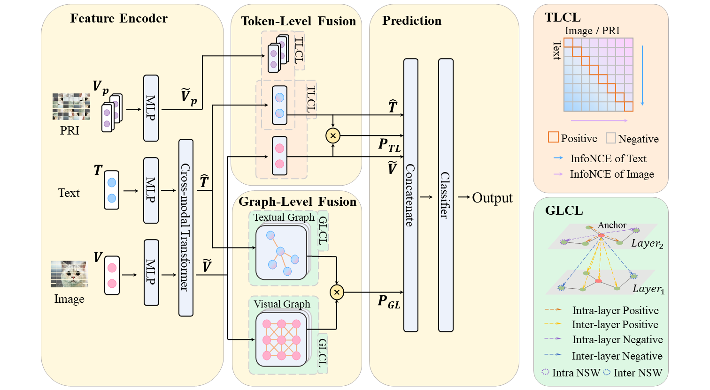

# DAIE

This is the official implementation of the paper "Dual-Level Adaptive Incongruity-Enhanced Model for Multimodal Sarcasm Detection", which is accepted by Neurocomputing. 
(https://doi.org/10.1016/j.neucom.2024.128689)

## Abstract
Multimodal sarcasm detection leverages multimodal information, such as image, text, etc. to identify special instances whose superficial emotional expression is contrary to the actual emotion. Existing methods primarily focused on the incongruity between text and image information for sarcasm detection. Existing sarcasm methods in which the tendency of image encoders to encode similar images into similar vectors, and the introduction of noise in graph-level feature extraction due to negative correlations caused by the accumulation of GAT layers and the lack of representations for non-neighboring nodes. To address these limitations, we propose a Dual-Level Adaptive Incongruity-Enhanced Model (DAIE) to extract the incongruity between the text and image at both token and graph levels. At the token level, we bolster token-level contrastive learning with patch-based reconstructed image to capture common and specific features of images, thereby amplifying incongruities between text and images. At the graph level, we introduce adaptive graph contrast learning, coupled with negative pair similarity weights, to refine the feature representation of the model’s textual and visual graph nodes, while also enhancing the information exchange among neighboring nodes. We conduct experiments using a publicly available sarcasm detection dataset. The results demonstrate the effectiveness of our method, outperforming several state-of-the-art approaches by 3.33% and 4.34% on accuracy and F1 score, respectively.

## Model Architecture

<div align=center>

</div>
The framework of dual-level adaptive incongruity-enhanced model (DAIE).

## Environment Requirements
The experiments were conducted on a single GeForce RTX 3090 GPU with 24GB memory. 
* Python 3.7.2
* PyTorch 1.8.0+cu111
* CUDA 11.2

To run the code, you need to install the requirements:
``` 
pip install -r requirements.txt
```

## Data Download
We evaluate our model using a publicly available multimodal sarcasm detection dataset. For the orginial dataset, see as https://github.com/headacheboy/data-of-multimodal-sarcasm-detection.

To run our code and for a fair comparison, we adhere to the preprocessing methods outlined in previous work. Please replace paths of datasets in *DATA_PATH* and *IMG_PATH* of `main.py` using your paths.

## Run Code

At last,  you can run the below code:

```shell
bash run.sh
```

## Papers for the Project & How to Cite

If you use or extend our work, please cite the paper as follows:
```
@article{wu2025dual,
  title={Dual-level adaptive incongruity-enhanced model for multimodal sarcasm detection},
  author={Wu, Qiaofeng and Fang, Wenlong and Zhong, Weiyu and Li, Fenghuan and Xue, Yun and Chen, Bo},
  journal={Neurocomputing},
  volume={612},
  pages={128689},
  year={2025},
  publisher={Elsevier}
}
```
